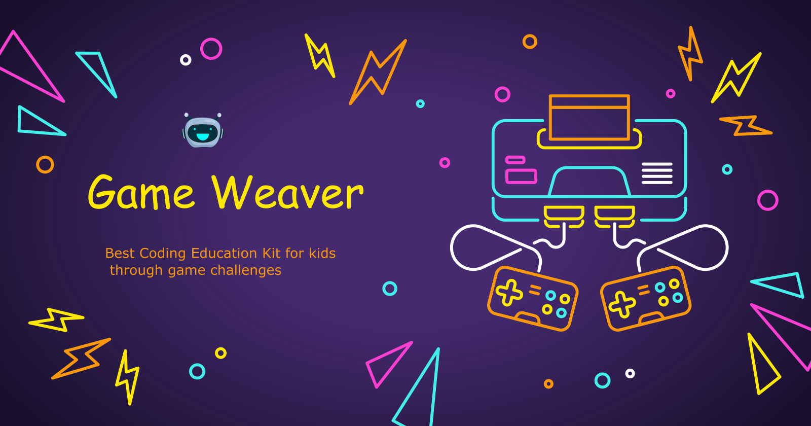

# Game Weaver

> The Best Coding Education Kit for kids through game challenges

Created @2022/08/16

## What it is:

```
Game Weaver is a lightweight web game  development environment designed for beginners.It includes a built-in web view for previewing game results and a JavaScript code editor for implementing game logic. Additionally, it features a lightweight tile map editor for drawing and exporting tile maps that can be loaded in PhaserJS games. Last but not  least, it also includes a rich set of game examples and source code for classic nostalgic games, providing coding beginners with an opportunity to dive in and get started.
```

## Who is this for:

- Coding beginners.
- Game development beginers.
- Anyone who want to try coding with an easy path.


## Main goals

- Programming cold start
- Coding with Javascript
- Game development fundamentals

## Main features

- HTML5(web) 2D game coding editor based on template(support phaserjs, pixijs) - v0.1;
- Game refresh with live preview - v0.1;
- PhaserJS-CE version game examples gallery - v0.1;
- Tilemap editor bisic for PhaserJS games - v0.2;

## Based on boilerplate

[Electron React Boilerplate](https://github.com/electron-react-boilerplate/electron-react-boilerplate)

## Main Building Bocks

- [ReactJS](https://reactjs.org/)
- [blueprintjs](https://blueprintjs.com/);
- [monaco-editor](https://microsoft.github.io/monaco-editor/);
- [Phaser CE](https://github.com/photonstorm/phaser-ce);
- [tailwindcss](https://tailwindcss.com/);
- [zustand](https://github.com/pmndrs/zustand);

## Version history

- V0.1 - Game code editor & examples module completion @2022/10/08
- V0.2 - Game map editor completion @2023/05/09

## Roadmap:

### v0.1 basic modules

- main module setup
- code editor
- phaser game examples gallery
- ...

### v0.2 tile-editor basic

- tilemap editor
- single tilesheet only
- tilemap json(tiled compatible format) export

### v0.3 primary game creation workflow

- docs & tutorials ... --- v0.3 GW completion
- ...

### v0.4 tile-editor plus

- sample game challenges ... --- v0.4 GW completion
- ...

### v0.5 classic 2D games 1st season

- paint using multiple tilesheet ... --- v0.3 GW completion
- ...


### v0.6 ...

- paint object layer ... --- v0.4 GW completion
- ...

## More...

## Credits

- Banner Image by <a href="https://www.freepik.com/free-vector/flat-neon-gaming-landing-page-template_33809377.htm#&position=4&from_view=collections">Freepik</a>
